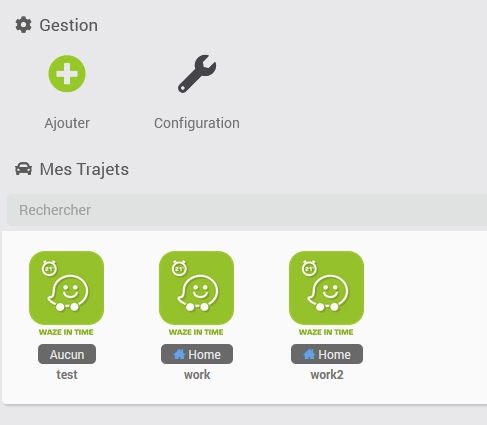

# Waze in Time Plugin

Mit diesem Plugin können Sie die Reiseinformationen (Verkehr berücksichtigt) über Waze abrufen. Dieses Plugin funktioniert möglicherweise nicht mehr, wenn Waze nicht mehr akzeptiert, dass wir seine Site abfragen

# Configuration

## Plugin Konfiguration

Um das Plugin verwenden zu können, müssen Sie es wie jedes Jeedom-Plugin herunterladen, installieren und aktivieren.

Danach müssen Sie Ihre Reise (n) erstellen. Gehe in das Plugins / Organisationsmenü, dort findest du das Waze in Time Plugin :

Dann kommen Sie auf die Seite, die Ihre Ausrüstung auflistet (Sie können mehrere Routen haben) und auf der Sie diese erstellen können, indem Sie auf die Schaltfläche "Hinzufügen" klicken":

Sie gelangen dann auf die Konfigurationsseite Ihrer Reise:

Auf dieser Seite finden Sie drei Abschnitte :

### Allgemeine Einstellungen

In diesem Abschnitt finden Sie alle Jeedom-Konfigurationen. Nämlich den Namen Ihres Geräts, das Objekt, dem Sie es zuordnen möchten, die Kategorie, ob das Gerät aktiv sein soll oder nicht und ob es auf dem Dashboard sichtbar sein soll.

Schließlich müssen Sie, wenn Sie möchten, das Auto-Update konfigurieren. Wenn Sie nichts konfigurieren, werden die Reiseinformationen nicht automatisch aktualisiert.

### Reiseparameter

Dieser Abschnitt ist einer der wichtigsten und ermöglicht es Ihnen, den Start- und Endpunkt festzulegen.

- Diese Informationen müssen die Breiten- und Längengrade der Positionen sein
- Sie können über die Website gefunden werden, indem Sie auf den Seitenlink klicken (geben Sie einfach eine Adresse ein und klicken Sie auf GPS-Koordinaten abrufen)

Es ist möglich, sie auf verschiedene Weise bereitzustellen:

- manuell müssen Sie dann den Breiten- und Längengrad direkt codieren
- über einen info-Befehl von einem anderen Jeedom-Plugin müssen Sie dann den Befehl auswählen, der die Informationen im Format 'Breitengrad, Längengrad . zurückgeben muss'
- über die Jeedom-Konfiguration (siehe Jeedom-Konfigurationsmenü)
- indem Sie direkt einen Befehl aus dem geoloc- oder geoloc_ios-Plugin auswählen, wenn diese Plugins vorhanden sind (diese Option sollte nicht mehr für neue Geräte verwendet werden, bevorzugen Sie die oben beschriebene Befehlsauswahloption)

Es ist auch möglich, die Abonnements auszuwählen, die bei der Berechnung der Fahrt aktiviert werden müssen. Sie müssen eine Liste von Werten eingeben, die durch ein Komma oder _ * _ getrennt sind, um alles zu aktivieren.

### Bildschirmeinstellungen

Diese Konfiguration ermöglicht es Ihnen einfach, die ausgewählten Fahrten im Widget auf dem Dashboard auszublenden, sie werden weiterhin aktualisiert, wenn die Ausrüstung aktualisiert wird.

### Bedienfeld

- Dauer 1, 2 & 3: Fahrzeit mit Route 1, 2 & 3
- Route 1, 2 & 3: Name der Route 1, 2 & 3 (von Waze . gegeben))
- Rückgabedauer 1, 2 & 3 : Hin- und Rückfahrt mit Route 1, 2 & 3
- Rückfahrt 1, 2 & 3 : Name der Rückfahrt 1, 2 & 3 (von Waze . gegeben))
- Aktualisieren : Informationen aktualisieren

Alle diese Befehle sind über Szenarien und über das Dashboard verfügbar

# Das Widget

- Die Schaltfläche oben rechts aktualisiert die Informationen.
- Alle Informationen sind sichtbar (bei Reisen kann die Reise, wenn sie lang ist, abgeschnitten werden, aber die Vollversion wird angezeigt, indem Sie die Maus darauf lassen)

# Wie werden Routen aktualisiert??

Die Informationen werden entsprechend der Auto-Update-Konfiguration des Geräts aktualisiert. Wenn nichts konfiguriert ist, werden die Fahrten nie automatisch aktualisiert.
Sie können sie bei Bedarf über das Szenario mit dem Aktualisierungsbefehl oder über das Dashboard mit den Doppelpfeilen aktualisieren.
