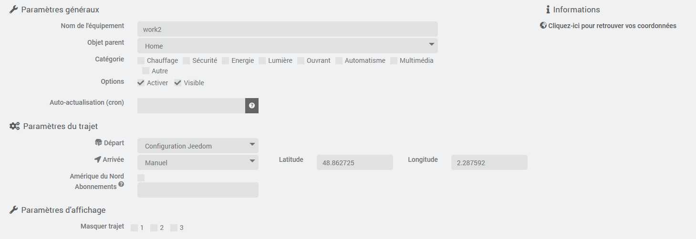

# Waze in Time plugin

This plugin allows you to have the trip info (traffic taken into account) via Waze. This plugin may no longer work if Waze no longer accepts that we interrogate its site

# Configuration

## Plugin configuration

In order to use the plugin, you must download, install and activate it like any Jeedom plugin.

After that you will have to create your trip (s). Go to the plugins / organization menu, you will find the Waze in Time plugin there :

Then you will arrive on the page which will list your equipment (you can have several Routes) and which will allow you to create it by clicking the "Add" button":

You will then arrive on the configuration page of your Trip:

On this page you will find three sections :

### General settings

In this section you will find all jeedom configurations. Namely the name of your equipment, the object to which you want to associate it, the category, if you want the equipment to be active or not, and if you want it to be visible on the dashboard.

Finally, you have to configure, if you wish, the auto-update. If you do not configure anything, the trip information will not be updated automatically.

### Trip parameters

This section is one of the most important and allows you to set the starting and ending point.

- These infos must be the latitudes and longitudes of the positions
- They can be found using the site provided by clicking on the page link (just enter an address and click on get GPS coordinates)

It is possible to provide them by several means:

- manually, you must then directly encode the latitude and longitude
- via an info command from another Jeedom plugin, you must then select the command which must return the information in the format 'latitude, longitude'
- via the Jeedom config (see Jeedom configuration menu)
- by directly selecting a command from the geoloc or geoloc_ios plugin if these plugins exist (this option should no longer be used for new equipment, prefer the command selection option explained above)

It is also possible to select the subscriptions that must be activated when calculating the journey. You must put a list of values separated by a comma or _ * _ to activate everything.

### Display settings

This configuration simply allows you to hide the selected trips in the widget on the dashboard, they will still be updated when the equipment is refreshed.

### Commands

- Duration 1, 2 & 3: duration to go with route 1, 2 & 3
- Route 1, 2 & 3: name of route 1, 2 & 3 (given by Waze)
- Return duration 1, 2 & 3 : return duration with route 1, 2 & 3
- Return journey 1, 2 & 3 : return trip name 1, 2 & 3 (given by Waze)
- Refresh : Refresh info

All these commands are available via scenarios and via the dashboard

# The widget

- The button at the top right refreshes the info.
- All information is visible (for trips, if the trip is long, it can be truncated but the full version is visible by leaving the mouse on it)

# How are routes updated?

The information is refreshed according to the auto-update configuration of the equipment. If nothing is configured, the trips will never be updated automatically.
You can refresh them on demand via scenario with the refresh command, or via the dashboard with the double arrows.
